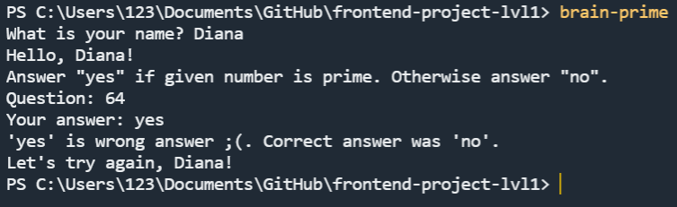

### Hexlet tests and linter status:
[](https://github.com/di-iv/frontend-project-lvl1/actions)
[](https://codeclimate.com/github/di-iv/frontend-project-lvl1/maintainability)

## Project setup
```
make install
```

## Install the packages on the system
```
make lint
```

## Game 1: "Even Numbers"
**_Rules: Answer "yes" if the number is even, otherwise answer "no"._**

The user answered all questions correctly.


The user made a mistake - game over.


## Game 2: "Calculator"
**_Rules: What is the result of the expression?_**

The user answered all questions correctly.


The user made a mistake - game over.


## Game 3: "Greatest common divisor"
**_Rules: Find the greatest common divisor._**

The user answered all questions correctly.


The user made a mistake - game over.


## Game 4: "Arithmetic progression"
**_Rules: What number is missing in the progression?_**

The user answered all questions correctly.


The user made a mistake - game over.


## Game 5: "Is it a prime number?"
**_Rules: Answer "yes" if given number is prime. Otherwise answer "no"._**

The user answered all questions correctly.


The user made a mistake - game over.




